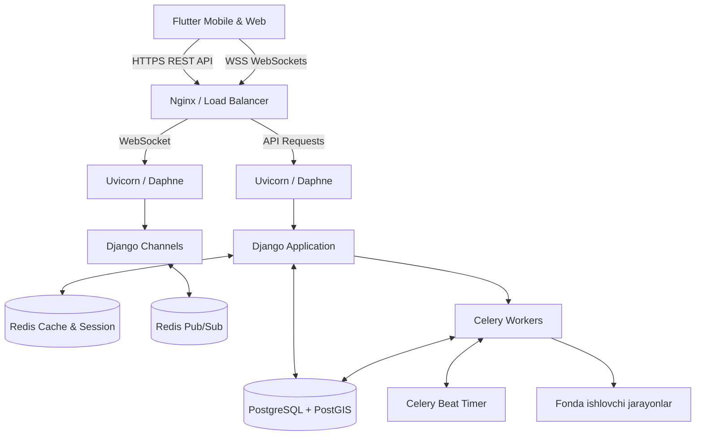

# MYFEEL: MVP Arxitekturasi va Texnik dizayni

MYFEEL tizimini dastlabki **MVP (Minimum Viable Product)** bosqichida maksimal tezlashtirib ishlab chiqish, shuningdek, kelajakda (qisqa vaqt ichida foydalanuvchilar soni keskin ortib ketsa) oson masshtablashtirish (scaling qilish) maqsadida loyihalashtirdik. 

Biz "Modular Monolith" (Modulli monolit) arxitekturasini tanlaymiz: barcha backend kodlari asosan bitta repozitoriyada bo'ladi, lekin mantiqiy modullarga (bounded contexts) qat'iy ajratilgan tarzda saqlanadi. Kelejakda bu modullarni mikroservislarga bo'lib chiqish juda oson bo'ladi.

## 1. Tizim Ekstrukchurasi (High-Level Design)

## 2. Texnik Stek (Poydevor vositalar)

*   **Frontend (Mobile/Web):** `Flutter`. Bitta kod bazasi. Animatsiyalar va dizaynga "Premium" va "Stressdan holi" (calm) yondashiladi. Flutter o'zining tezkor render dvigateli bilan 3 soniyalik FeelFlow hisslarini chiroyli qilib ko'rsatib, hissiy yengillik beradi.
*   **Backend & API:** `Python`, `Django v5`, `Django REST Framework`. Yuqori xavfsizlik va tezkor ishga tushirish (MVP uchun eng qulay tanlov).
*   **Asinxron va Real-time Tizimlar:** `Django Channels` (Websockets uchun) va asinxron Python yondashuvi.
*   **Ma'lumotlar Bazasi:** `PostgreSQL`. (Mood Map'dagi joylashuv (radius) va xaritalar funksiyasi hamda tezkor qidiruv uchun **PostGIS** plagini qo'shiladi).
*   **Kesh & In-Memory Data:** `Redis`. Real-time FeelChat (chatlar) va MoodMap'dagi xaritalarni soniyalarda qotmasdan chizish va "matchmaking" algoritmlari uchun.
*   **Media xotira / Storage:** `AWS S3` yoki o'zimizning serverda `MinIO` (Time Capsule'dagi rasm, video xabarlar xavfsiz saqlanishi uchun).
*   **Orqa fon jarayonlari (Background Jobs):** `Celery`.

## 3. Asosiy Backend Modullari (Django Apps)

Loyiha tizimida tartibsizlik bo'lmasligi va kelajakdagi jamoa oson tushunishi uchun quyidagi Bounded Context-larga ajratamiz:

1.  **`users` yoki `accounts`**: Foydalanuvchilarni ro'yxatga olish, autentifikatsiya va sessiyalar. Asosiy maqsad — daxlsizlik! Ism-sharif o'rniga ehtimol shunchaki avatarlar / maxfiy tokenlar yordamida ishlashni ta'minlaydi. 
2.  **`feelflow`**: Foydalanuvchi "men shunday his qilyapman" deb rang/stiker orqali signal beradigan asosiy modul. `Streak` statistikalari (kunlik munosabatlari) tahlilini yig'adi.
3.  **`capsule`**: Time Capsule (Kelajakka xat) mantig'i. Foydalanuvchi datasi, qo'yilgan vaqt, va ochiladigan muddat saqlanadi. `Celery Beat` har kuni bazani tekshirib, ochilish vaqti kelgan xatlarni egasiga bildirishnoma (Push Notification) tarzida yetkazib beradi.
4.  **`map`**: Mood Map. Algoritmlar yordamida har bir shahar va davlatdagi emotsiyalarni klasterlash (Heatmap yaratish). Redis geohash imkoniyatlaridan foydalanib o'ta serqatnov so'rovlarni oson ko'tarish imkonini beradi.
5.  **`chat`**: FeelChat. WebSocket / Channels orqali bir xil emotsiyadagi odamlarni (masalan, ikkita yolg'izlanayotgan foydalanuvchini) xavfsiz va tezkor suhbat xonasiga (room) ulash algoritmi (Matchmaker).

## 4. Infratuzilma va Masshtablash (Scaling) Rejasi

Loyiha "1 milliardga mo'ljallangan" bo'lsa-da, shu maqsad sari moliyaviy barqaror holda boramiz:

### Bosqich 1: MVP va Validatsiya (0 - 100,000 foydalanuvchi)
Docker Compose orqali bitta yoki ikkita Cloud VPS serverda yotqiziladi. 
* 1 ta Nginx (Reverse Proxy) + SSL
* 2 ta Web (API) Backend Konteyneri
* PostgreSQL (Managed yoki Konteynerda)
* Redis
Bu bosqichda arzon, boshqarish oson va versiyalarni kuniga 10 marta yangilasangiz ham downtime (uzilishlar) deyarli bo'lmaydi.

### Bosqich 2: O'sish va Monetizatsiya (100k - >1 mln)
Oldinga AWS ALB/ELB (Load balancer) qo'yiladi. Backend serverlar AWS EC2 yoxud DigitalOcean Droplets ko'rinishida gorizontal ko'paytiriladi. Ma'lumotlar bazasi alohida Managed Database klasteriga o'tkaziladi.

### Bosqich 3: High-Load (Dunyoga Chiqish - 1+ Million - 2035 yosh)
Tizim "Microservices" elementlariga bo'linadi va **Kubernetes (K8s)** klasteriga ko'chiriladi:
* Masalan: Chat xizmati asinxron xizmat ko'rsatish maqsadida Go tilida, yoki alohida klasterda ko'tarilishi mumkin.
* "MYFEEL Index" (YaIB - Yalpi ichki baxtni tahlil qiluvchi big-data qismi) uchun `ClickHouse` kabi analitika bazalari ulangan holda ishlashni boshlaydi.

## 5. Ochiq Savollar (User Review Required)

> [!WARNING]
> Quyidagi savollarning javoblari loyihaning texnik strategiyasini aniqlab beradi:

1. **Autentifikatsiya yondashuvi:** Platforma to'liq anonim ravishda (faqat smartfon/qurilma ID'si orqali bir marta klik bilan) ishlaydimi yoki e-mail / Google / Apple sign-in kabi usullardan foydalanadimi? (Anonimlik odamlarni qo'rquvsiz erkin ochilishlariga olib keladi, lekin akkauntni tiklash qiyinlashadi).
2. **Geolokatsiya va Maxfiylik:** "Mood Map" interfeysida foydalanuvchilarni faqat Shahar markaziga birlashtirib (koordinata aniqligini kamaytirib) yuborish ma'qulmi yoki rayonlar ko'rinishidami?
3. **Ishni qay yerdan boshlaymiz?** Aynan API prototiplarini (Django) ko'tarib, tizimni qurasimizmi yoki asosiy e'tiborni eng avvalo arxitekturaviy papkalar va infrastrukturani yig'ishga qaratamizmi?

---
Ushbu MVP reja qabul qilinsa hamda Ochiq Savollardagi masalalar muhokama qilib olinsa, darhol amaliy ishga (kodlashga) kirishamiz.
